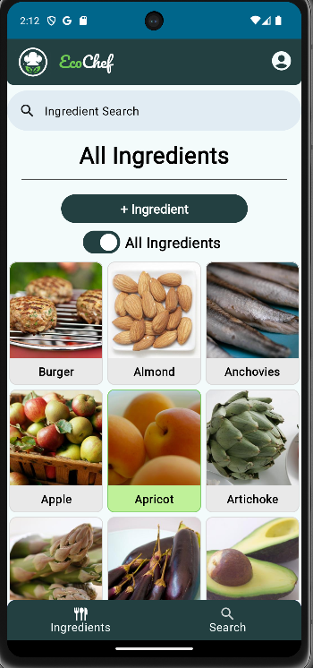
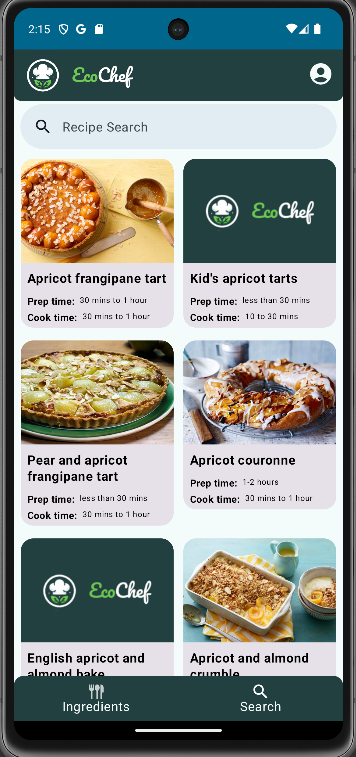
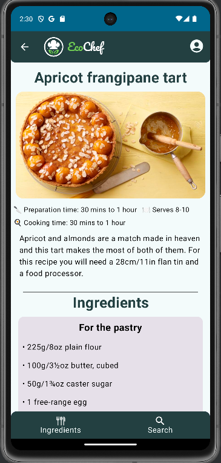
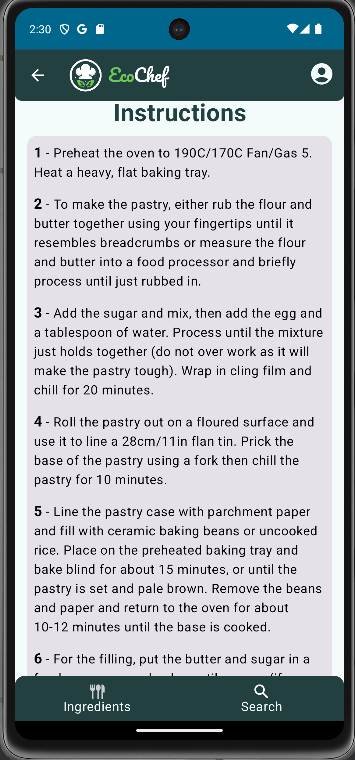

Users select their ingredients and then can search for recipes that will include all ingredients, instructions and relevant details

Ecochef worked by scraping recipes from BBC Foods' website and then displaying them to the user based on relevance of ingredients

<tb>
  <tr>
<tc></tc>
<tc></tc>
<tc></tc>
  </tr>
</tb>

Source: <a href="https://github.com/TH3Eimis/ecochef"><i class="large github icon "></i></a>
