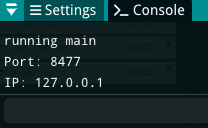
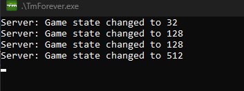
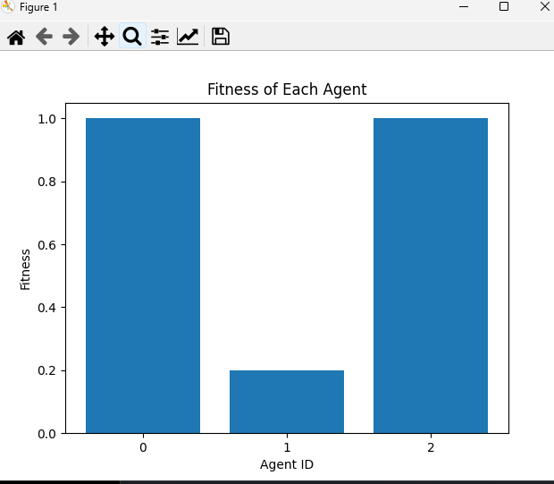
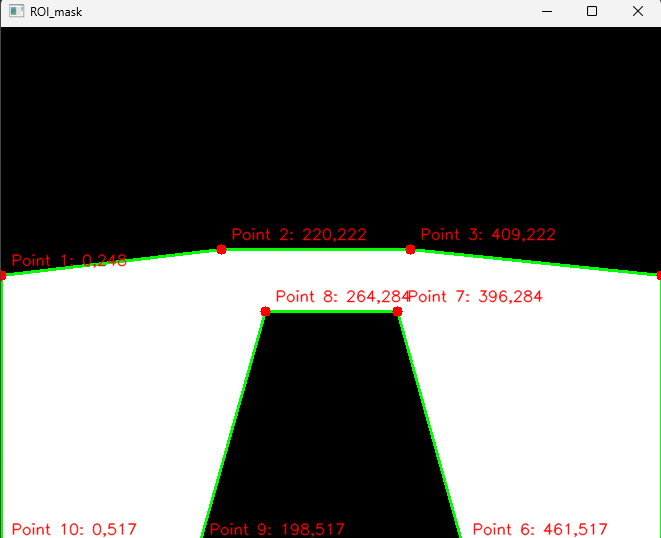

**Project Description:**
A sophisticated AI system developed to interact with Trackmania, designed to read game data, send control inputs, and optimize agent performance through real-time communication and advanced image processing.

**Key Features:**
- **TMinterface Integration:** Utilized TMinterface to directly interact with Trackmania, allowing the plugin to read game data and send control inputs. TMinterface details: [https://donadigo.com/tminterface/](https://donadigo.com/tminterface/)
- **Socket Connection:** Established a socket connection on localhost port 8000 to facilitate real-time communication between the game plugin and Python code. [Figure 1]
- **Game State Monitoring:** Designed the system to read game state changes, trigger the execution of agents, and collect performance data. [Figure 2]
- **Reward System:** Implemented a reward system that evaluates agents based on track completion time, medals earned, average speed, and crash count, driving the evolutionary process. [Figure 3]
- **Agent Vision:** Developed agent "vision" by capturing screenshots of the Trackmania tab, applying preprocessing, and cropping around a region of interest (ROI). [Figure 4]
- **Edge and Curve Prediction:** Enabled agents to use edge and curve prediction for navigation, allowing them to recognize borders and navigate effectively. [Figure 5]
- **Extensive Testing:** Conducted extensive testing to fine-tune the algorithm and improve the overall performance and reliability of the agents.

**Technologies Used:**
- Python
- OpenCV
- Socket Programming

**Project Duration:**
- Start Date to End Date (e.g., January 2023 - March 2023)

**Role and Responsibilities:**
- Integrated TMinterface to interact with Trackmania.
- Established and managed the socket connection for real-time communication.
- Developed the reward system for agent evaluation.
- Implemented image preprocessing and agent vision.
- Conducted extensive testing and optimization.

**Challenges Faced:**
Integrating real-time communication and developing an effective reward system were challenging. Resolved these by optimizing the socket connection and fine-tuning the reward metrics.

**Achievements and Outcomes:**
- Improved agent performance significantly with faster track completion times and fewer crashes.
- Successfully demonstrated the effectiveness of using image processing for game agent navigation.

**Links:**
- [Project Repository](#https://github.com/TH3Eimis/TMAI/tree/main)

**Screenshots:**

  
   Figure 1: Socket Connection

  
   Figure 2: Game State Monitoring

  
   Figure 3: Reward System

  
   Figure 4: Agent Vision

  
   Figure 5: Edge and Curve Prediction

Source: <a href="https://github.com/TH3Eimis/TMAI/tree/main"><i class="large github icon ">TMAI Repository</i></a>

