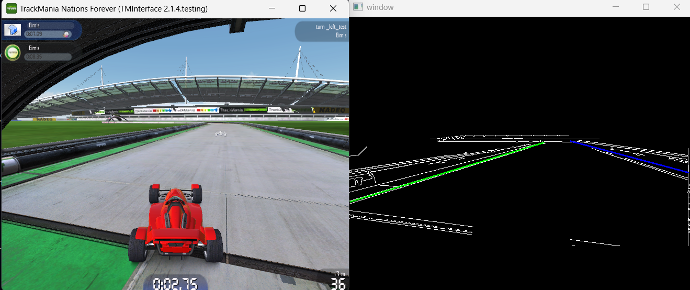

An agent "vision" consists of a screenshot of the Trackmania Tab to which some preprocessing is applied and the image is cropped around an ROI (region of interest) 

Agents use edge/curve prediction to navigate their surroundings, allowing them to recognise borders and navigate around.

The program retrieves the in-game data using TMInterface (https://donadigo.com/tminterface/) a tool used to create and run TMNF plugins, this allowed me to create a plugin that was directly able to read the game data and then communicate with a socket connection running on the main python code

Source: <a href="https://github.com/TH3Eimis/TMAI/tree/main"><i class="large github icon "></i>TMAI Repository</a>
 
