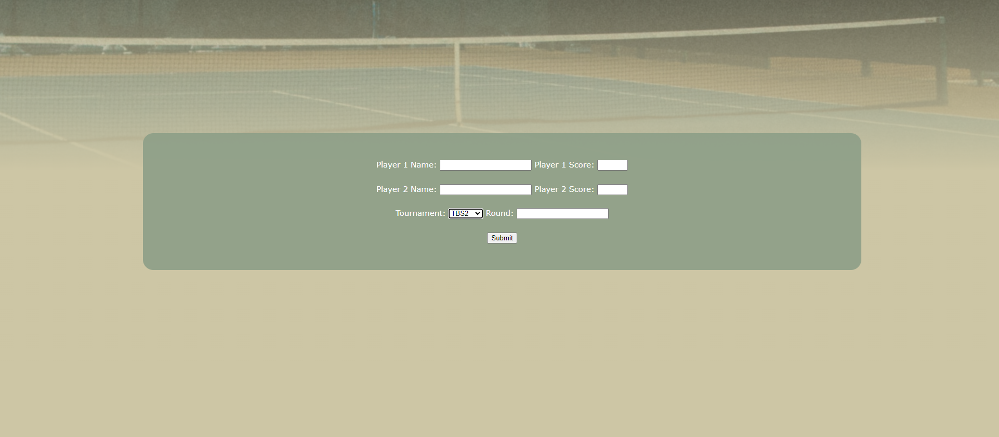
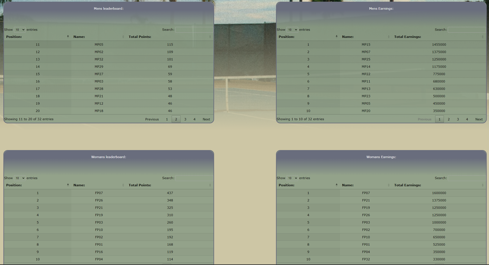
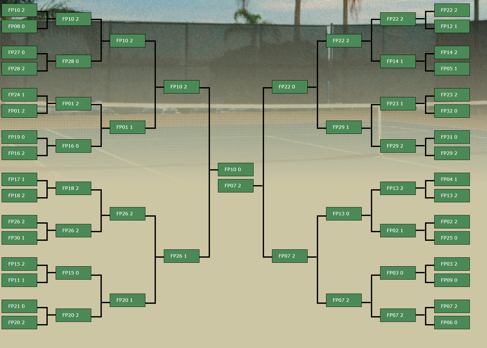

**Project Description:**
The project goal was to create a simple web application which allows staff to upload tennis tournament data --from an ongoing or completed tennis match/tournament. The system automatically allocates points based on user-defined targets, stores and retrieves game data from a MySQL database, and displays an automatically generated tournament bracket.

**Key Features:**
- **Data Upload:** Allows users to upload tennis tournament data and match results for individual players. [Figure 1]
- **Automated Points Allocation:** Automatically allocates points to players based on targets set by the shareholder (user). [Figure 2]
- **Database Integration:** Stores and retrieves game data using a MySQL database, ensuring data persistence and accessibility. [Figure 2]
- **Tournament Bracket Display:** Automatically generates and displays a tournament bracket based on the uploaded data. [Figure 3]

**Technologies Used:**
- Frontend: HTML, CSS, JavaScript
- Backend: Flask
- Database: MySQL

**Project Duration:**
- Febuary 2023 - April 2023

**Role and Responsibilities:**
- Designed and implemented the user interface for data upload and tournament bracket display.
- Developed the backend functionality for automated points allocation and data storage.
- Integrated the MySQL database for storing and retrieving game data.
- Conducted testing to ensure functionality and data integrity.

**Challenges Faced:**
Challenges included ensuring accurate point allocation based on variable user-defined targets and maintaining data consistency between the application and the MySQL database. Solutions included implementing robust validation and error-handling mechanisms.

**Achievements and Outcomes:**
- Successfully implemented an automated system for points allocation and tournament bracket generation.
- Enabled users to manage and visualize tournament data efficiently.
- Improved data accessibility and management through integration with MySQL.

**Links:**
- [Project Repository](#https://github.com/TH3Eimis/tennis-tournament-web/tree/main)

**Screenshots:**

  
   Figure 1: Data Upload Interface

  
   Figure 2: Leaderboards & Automated Points Allocation

  
   Figure 3: Tournament Bracket Display

Source: <a href="https://github.com/TH3Eimis/tennis-tournament-web/tree/main"><i class="large github icon ">Tennis tournament repository</i></a>
 
